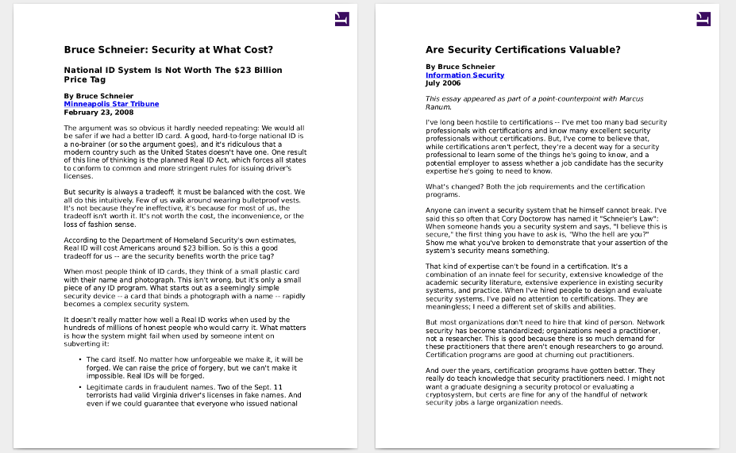

# Blog ripper suite - part 2

Have you ever wanted to rip your favorite blog? Like, download all posts, convert them to pdfs, print them out or whatever.

No?

Well, you have a chance to do that now!

This script intelligently transforms all html files to beautiful pdfs. 
Additionaly, it can remove special chars from the final filenames! Yeah!




## How it works

The process looks like this:
 1. the script searches for all html files in current directory
 2. it identifies the website core content and extract it (extractor.py)
 3. inserts your own headers and footers (extractor.py)
 4. converts to beautiful pdf files using Prince XML
 5. finally, it copies all the pdfs to one directory


## Requirements

* Downloaded html files using [ScrapBook Firefox Add-On](https://addons.mozilla.org/en-US/firefox/addon/scrapbook/), for example
* [Prince XML](https://www.princexml.com/download/)
* Python ~2.7
* Beautiful Soup library
* Linux

## Getting Started


To convert:
```
$ ripper-start.sh <HTMLs directory> <PDFs directory>
```


To clean filenames:
```
$ ripper-rename.sh 
```

## Authors

* Karol Bonenberg


## License

This project is licensed under the GNU GPL Version 3 - see the [LICENSE.md](LICENSE.md) file for details
